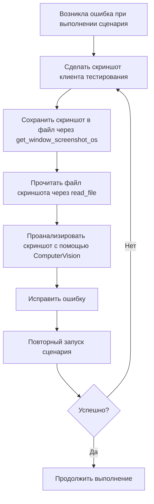

# 📘 Руководство по созданию сценариев тестирования

## 📋 Общие вводные

### Подготовка к работе

> ⚠️ **КРИТИЧЕСКИ ВАЖНО:** Порядок действий является обязательным. Нарушение порядка приводит к ошибкам при создании сценариев.

1. **Получение информации из базы знаний**
   - ⚠️ **Это должно быть выполнено ПЕРВЫМ действием после прочтения Instructions.md**
   - ⚠️ **НЕЛЬЗЯ использовать другие форматы (short_info, questions_only и т.д.) перед загрузкой всей базы**
   - Загрузите всю базу знаний целиком и только так:
     ```
     инструмент: get_data_from_knowledge_base
     параметр: format=all
     ```
   - При создании сценариев тестирования необходимо следовать рекомендациям из базы знаний.
   - ❗ **Типичная ошибка:** Попытка сначала получить краткую информацию о базе знаний или часто используемые шаги перед полной загрузкой базы. Это приводит к тому, что сценарий создаётся без полного контекста.
   - ❗ **КРИТИЧЕСКИ ВАЖНО:** После загрузки базы знаний (format=all) **ОБЯЗАТЕЛЬНО проанализируйте полученное содержимое** и примените рекомендации при создании сценария.
     - Не просто загрузите базу знаний, но **прочитайте и используйте** содержащуюся в ней информацию
     - Особое внимание уделите разделам, относящимся к создаваемому сценарию

2. **Загрузка опыта предыдущей работы**
   - Прочитайте файл `Memory.MD` для загрузки накопленного опыта.
   - ⚠️ **Важно:** Этот шаг выполняется ПОСЛЕ загрузки базы знаний (шаг 1).

3. **Анализ часто используемых шагов**
   - ⚠️ **Важно:** Этот шаг выполняется ПОСЛЕ загрузки базы знаний (шаг 1).
   - Получите информацию о наиболее часто используемых шагах с помощью `frequently_used_steps` с параметром `limit=100`.
   - Старайтесь использовать эти шаги, когда это возможно.

---

## 🔧 Предварительные действия перед запуском сценария на выполнение

### Обязательные шаги

| Шаг | Описание |
|-----|----------|
| 1 | Перед запуском сценария на выполнение вызывайте **проверку синтаксиса** |
| 2 | В начало сценария всегда добавляйте **закрытие всех окон** |
| 3 | Получите данные всего командного интерфейса через `manage_command_interface` для исследования кнопок панели разделов и панели функций |

> **Примечание:** Инструмент `manage_command_interface` вызывается с разными параметрами `action` в зависимости от задачи:
>
> **Порядок исследования интерфейса:**
> 1. Сначала получите панель разделов: `action=get_section_panel`
> 2. Для каждой кнопки панели разделов получите панель функций: `action=get_function_panel`
> 3. Далее надо использовать инструмент `manage_form_elements`, чтобы "вручную" выполнить действия из будущего сценария.
     При этом нужно исследовать какие реквизиты есть в формах, какие у них типы. Чтобы потом было проще создать сценарий тестирования.

> **Примечание:** Для закрытия всех окон используйте шаг:
> ```gherkin
> И я закрываю все окна клиентского приложения
> ```
> **Категория:** `UI.Окна`

### Особенности работы с формами настроек

- ❌ В формах настроек **нет кнопок** `Записать` и `ЗаписатьИЗакрыть`
- 🚩 Если флаг настройки не устанавливается с сообщением:
  > *"Невидимый пользователю элемент управления не может выполнять интерактивные действия"*
  
  → Необходимо добавить шаг, который **разворачивает группу**, в которой находится флаг:
  ```gherkin
  И я разворачиваю группу "Заголовок группы"
  ```
  или по имени группы:
  ```gherkin
  И я разворачиваю группу с именем 'ИмяГруппы'
  ```
  
  → После разворачивания группы повторите установку флага.


### Как проверять табличный документ в отчете

1. Запустите сценарий, чтобы он дошёл до формы отчета.

2. Сохраните табличный документ в файл с помощью инструмента `save_table_document_to_file`:
   ```
   инструмент: save_table_document_to_file
   параметр: form_element_name=ИмяТабличногоДокумента
   параметр: file_name=путь/к/файлу/output.mxl
   параметр: format=mxl (по умолчанию)
   ```

3. Сравните табличный документ с эталонным макетом, используя один из шагов:

   **Для сравнения всего документа:**
   ```gherkin
   Тогда табличный документ "ИмяРеквизита" равен макету "ИмяМакета"
   ```
   
   **Для сравнения по шаблону (с символами *):**
   ```gherkin
   Тогда табличный документ "ИмяРеквизита" равен макету "ИмяМакета" по шаблону
   ```

   > **Примечание:** Макет ищется сначала в обработке фича-файла, затем в каталоге проекта. Если в ячейке эталона указан символ `*`, такая ячейка не участвует в сравнении.

### В начале сценария надо добавить пометку на удаление данных, которые были созданы предыдущими запусками сценария.

---

## 📝 Требования к сценарию

### Структурные требования

```
✅ Должен получиться ОДИН сценарий
✅ Сценарий должен работать без ошибок и выполняться с начала и до конца с помощью инструмента run_scenario и без использования инструмента stop_scenario.
❌ Если сценарий выполняется с ошибкой — вся задача считается невыполненной
```

### Отладка сценария

Если во время выполнения сценария возникла ошибка связнная с тем, что не найден элемент формы (поле, кнопка, флаг и т.д) и ошибка будет исправляться тем,
что в шаге будет заменено имя элемента формы, то в таком случае нельзя выполнять сценарий с самого начала,
а надо выполнить сценарий с номера строки, в которой находится исправляемый шаг.
Это связано с тем, что выполнять сценарий с самого начала при такой ошибке долго и нет смысла.

Если во время выполнения сценария возникла ошибка связнная с тем, что не получилось нажать на команду панели функций,
то в таком случае после исправления шага нельзя выполнять сценарий с самого начала,
а надо выполнить сценарий с номера строки, в которой находится исправляемый шаг.
Это связано с тем, что выполнять сценарий с самого начала при такой ошибке долго и нет смысла.

### Ограничения и разрешения

## Требуется

* ✅ Использовать шаги из базы знаний.
* ✅ Использовать стандартные шаги Vanessa.
* ✅ Использовать комментарии для проверок.
* ✅ Расширение у feature файла должно быть `feature`


## Запрещено

* ❌ Подключать клиент тестирования, если он уже подключен и нет требований запускать клиент тестирвания под разными пользователями.
* ❌ Использовать секцию Переменные.
* ❌ Подключать библиотеку шагов.
* ❌ Использовать Попытку/Исключение.
* ❌ Использовать секцию Контекст.


### Форматирование проверок

Для каждой проверки из списка требований создавайте комментарий с полным именем проверки:

```gherkin
// 4. Указать организацию: «Андромеда плюс».
```

> **Важно:** Если в требовании указано, что надо сделать проверку — убирать её нельзя.

---

## 🚨 Обработка ошибок

### Алгоритм действий при ошибке



> **Примечание:** ComputerVision — это встроенная возможность AI-модели для анализа изображений. После чтения файла скриншота через `read_file` модель автоматически проанализирует изображение с помощью своих возможностей компьютерного зрения.
Если не получилось снять скриншот — надо остановить выполнение задачи и сообщить об этом пользователю:

1. Выполнить голосовое уведомление об ошибке:
   ```
   инструмент: voice_notification
   параметр: notification_type=error_occurred
   ```

2. Вывести подробное описание проблемы в лог.

3. Написать пользователю о возникшей проблеме с невозможностью снятия скриншота.

### Критические ситуации

Если **не получилось выполнить какой-то пункт из списка требований после 2 попыток исправления** или **какой-то шаг сценария не выполнился после 2 попыток исправления**:

> **Пояснение:** После возникновения ошибки вы пытаетесь её исправить. Если после **двух попыток исправления и повторного запуска** ошибка всё ещё возникает — это критическая ситуация.

1. **Шаг 1:** Выполнить голосовое уведомление:
   ```
   инструмент: voice_notification
   параметр: notification_type=decision_required
   ```

2. **Шаг 2:** Вывести подробное описание проблемы в лог.

3. **Шаг 3:** Остановить выполнение задачи (агент останавливает выполнение самостоятельно).

4. **Шаг 4:** Написать пользователю, что требуется его вмешательство.

> **Важно:** После голосового уведомления агент **самостоятельно останавливает** выполнение задачи. Не нужно ждать автоматической приостановки — агент должен явно прекратить выполнение после уведомления пользователя.

---

## ✅ Завершение работы

### Успешное выполнение

Когда сценарий полностью написан и проходит успешно (выполняется с помощью инструмента run_scenario) без ошибок:

```
инструмент: voice_notification
параметр: notification_type=task_completed
```

### После выполнения задачи

1. 📚 Напиши, какие знания стоит добавить в базу знаний инструмента `get_data_from_knowledge_base`
   
   > **База знаний Vanessa Automation** — универсальная база знаний, которая не привязана к конкретной конфигурации 1С. Содержит общие вопросы, подходы и паттерны тестирования.
   >
   > **Что записывать:** алгоритмы работы с инструментами, общие паттерны написания тестов, типовые решения проблем, не зависящие от конкретной конфигурации.

2. 💾 Сохрани и актуализируй важные знания в файл `Memory.MD`, если их там ещё нет.
   
   > **Memory.MD** — знания, накопленные при написании тестов для конкретной конфигурации 1С (например, ERP).
   >
   > **Что записывать:** особенности тестирования конкретных объектов конфигурации (справочники, документы, отчеты), специфичные для данной конфигурации шаги, известные проблемы и их решения в рамках этой конфигурации.

---


## 📌 Чек-лист проверки выполнения задачи

- [ ] База знаний загружена полностью (format=all)
- [ ] **База знаний проанализирована и рекомендации применены**
- [ ] Файл Memory.MD прочитан
- [ ] Получены данные о часто используемых шагах
- [ ] Получены данные командного интерфейса (панель разделов и функций)
- [ ] Получена информация по формам, которые будут участвовать в сценарии до того как сценарий написан.
- [ ] В начало сценария добавлено закрытие всех окон
- [ ] В начало сценария добавлена пометка на удаление данных, созданных предыдущими запусками
- [ ] Проверка синтаксиса выполнена
- [ ] Все проверки оформлены комментариями
- [ ] Сценарий представляет собой единое целое
- [ ] Отсутствуют запрещённые конструкции (Попытка/Исключение, секция Переменные)
- [ ] Сценарий полностью написан
- [ ] Сценарий проходит успешно (выполняется с помощью инструмента run_scenario) без ошибок
- [ ] Записаны новые знаний в файл `Memory.MD`
- [ ] Пользователю написано, что следует изменить в базе знаний Vanessa Automation.

