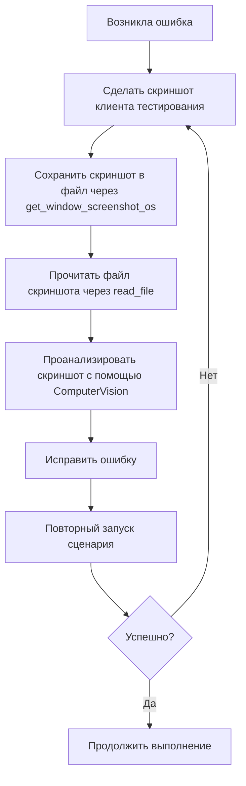

# 📘 Руководство по созданию сценариев тестирования

## 📋 Общие вводные

### Подготовка к работе

> ⚠️ **КРИТИЧЕСКИ ВАЖНО:** Порядок действий является обязательным. Нарушение порядка приводит к ошибкам при создании сценариев.

1. **Получение информации из базы знаний**
   - ⚠️ **Это должно быть выполнено ПЕРВЫМ действием после прочтения Instructions.md**
   - ⚠️ **НЕЛЬЗЯ использовать другие форматы (short_info, questions_only и т.д.) перед загрузкой всей базы**
   - Загрузите всю базу знаний целиком и только так:
     ```
     инструмент: get_data_from_knowledge_base
     параметр: format=all
     ```
   - При создании сценариев тестирования необходимо следовать рекомендациям из базы знаний.
   - ❗ **Типичная ошибка:** Попытка сначала получить краткую информацию о базе знаний или часто используемые шаги перед полной загрузкой базы. Это приводит к тому, что сценарий создаётся без полного контекста.

2. **Загрузка опыта предыдущей работы**
   - Прочитайте файл `Memory.MD` для загрузки накопленного опыта.

3. **Анализ часто используемых шагов**
   - Получите информацию о наиболее часто используемых шагах с помощью `frequently_used_steps` с параметром `limit=100`.
   - Старайтесь использовать эти шаги, когда это возможно.

---

## 🔧 Предварительные действия перед запуском

### Обязательные шаги

| Шаг | Описание |
|-----|----------|
| 1 | Перед запуском сценария на выполнение вызывайте **проверку синтаксиса** |
| 2 | В начало сценария всегда добавляйте **закрытие всех окон** |
| 3 | Получите данные всего командного интерфейса через `manage_command_interface` для исследования кнопок панели разделов и панели функций |

### Особенности работы с формами настроек

- ❌ В формах настроек **нет кнопок** `Записать` и `ЗаписатьИЗакрыть`
- 🚩 Если флаг настройки не устанавливается с сообщением:
  > *"Невидимый пользователю элемент управления не может выполнять интерактивные действия"*
  
  → Необходимо добавить шаг, который **разворачивает группу**, в которой находится флаг.


### Как проверять табличный документ в отчете
- Надо запустить сценарий, чтобы он дошел до формы отчета.
- Надо использовать инструмент save_table_document_to_file как это описано в базе знаний
- Затем надо использовать шаг для полного сравнения отчета с эталоном

### В начале сценария надо добавить пометку на удаление данных, которые были созданы предыдущими запусками сценария.

---

## 📝 Требования к сценарию

### Структурные требования

```
✅ Должен получиться ОДИН сценарий
✅ Сценарий должен работать без ошибок и выполняться с начала и до конца
❌ Если сценарий выполняется с ошибкой — вся задача считается невыполненной
```

### Ограничения

| Запрещено | Разрешено |
|-----------|-----------|
| ❌ Подключать клиент тестирования заранее | ✅ Клиент тестирования уже подключен |
| ❌ Использовать секцию `Переменные` | ✅ Использовать шаги из базы знаний |
| ❌ Подключать библиотеку шагов | ✅ Использовать стандартные шаги Vanessa |
| ❌ Использовать `Попытку/Исключение` | ✅ Использовать комментарии для проверок |

### Форматирование проверок

Для каждой проверки из списка требований создавайте комментарий с полным именем проверки:

```gherkin
// 4. Указать организацию: «Андромеда плюс».
```

> **Важно:** Если в требовании указано, что надо сделать проверку — убирать её нельзя.

---

## 🚨 Обработка ошибок

### Алгоритм действий при ошибке


Если не получилось снять скриншот - надо остановить выполнение задачи и сообщить об этом пользователю.

### Критические ситуации

Если **не получилось выполнить какой-то пункт из списка требований 2 раза подряд** или **какой-то шаг сценария не выполнился 2 раза подряд**:

1. **Шаг 1:** Выполнить голосовое уведомление:
   ```
   инструмент: voice_notification
   параметр: notification_type=decision_required
   ```

2. **Шаг 2:** Вывести подробное описание проблемы в лог и:
   - ⏸️ Остановить работу по созданию сценария
   - 📢 Написать пользователю, что требуется его вмешательство

---

## 📌 Чек-лист перед запуском

- [ ] База знаний загружена полностью (format=all)
- [ ] Файл Memory.MD прочитан
- [ ] Получены данные о часто используемых шагах
- [ ] Получены данные командного интерфейса (панель разделов и функций)
- [ ] В начало сценария добавлено закрытие всех окон
- [ ] Проверка синтаксиса выполнена
- [ ] Все проверки оформлены комментариями
- [ ] Сценарий представляет собой единое целое
- [ ] Отсутствуют запрещённые конструкции (Попытка/Исключение, секция Переменные)


## ✅ Завершение работы

### Успешное выполнение

Когда сценарий полностью написан и проходит успешно без ошибок:

```
инструмент: voice_notification
параметр: notification_type=task_completed
```

### После выполнения задачи

1. 📚 Напиши, какие знания стоит добавить в базу знаний инструмента `get_data_from_knowledge_base`
   В эту базу знаний записываются универсальные знания и алгоритмы, которые не зависят от конкретной задачи.
2. 💾 Сохрани важные знания в файл `Memory.MD`, если их там ещё нет.
	Сюда записываются знания об особенностях тестирования.

---

