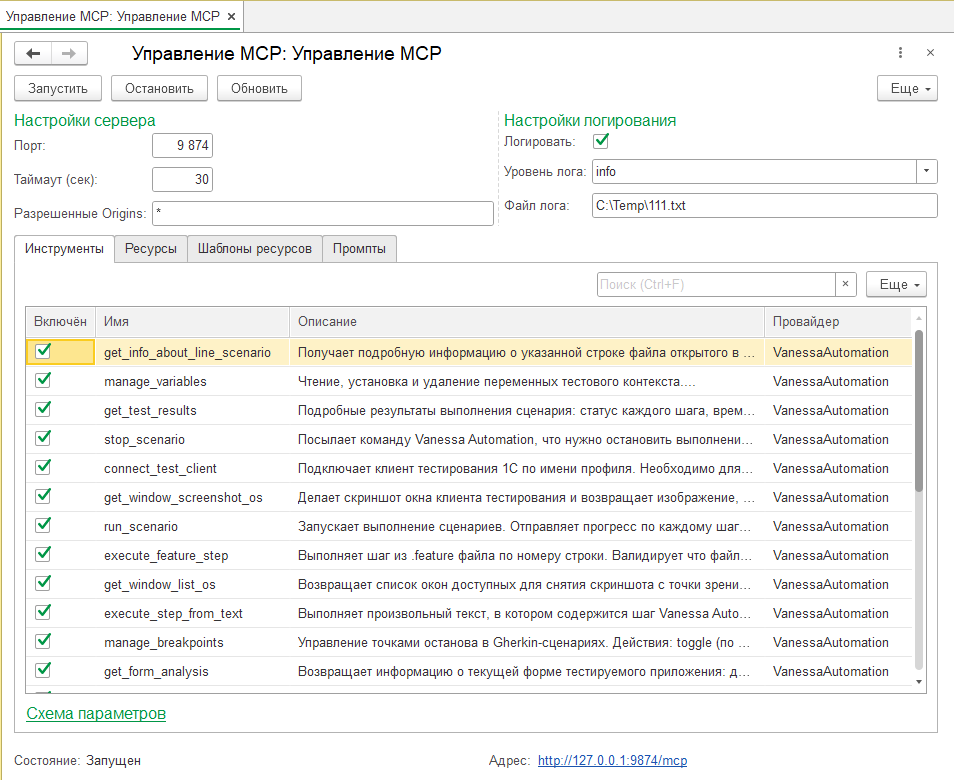

# MCP в Vanessa Automation

## Как начать использовать MCP Vanessa Automation
* Нужно установить в базу менеджера тестирования расширение из проекта [onec-client-mcp-devkit](https://github.com/1c-neurofish/onec-client-mcp-devkit/releases)
* При запуске Vanessa Automation определяет, что в базе установлено это расширение и регистрирует в нём свои инструменты
* В форме плагина **web-transport-addin** нужно нажать на кнопку "Запустить"
* Лучше сначала запустить MCP сервер, а затем запускать ИИ среду рарзработки


## Примеры конфигов для разных сред управления ИИ
### Плагин Continue для VSCode
* Путь к файлу конфига: "C:\Users\ИмяПользователя\.continue\mcpServers\VanessaAutomation.yaml"
```yaml
name: VanessaAutomation
version: 0.0.1
schema: v1
mcpServers:
  - name: VanessaAutomation
    type: streamable-http
    url: http://localhost:9874/mcp
```

### Плагин cline для VSCode
* Путь к файлу конфига: "C:\Users\ИмяПользователя\AppData\Roaming\Code\User\globalStorage\saoudrizwan.claude-dev\settings\cline_mcp_settings.json"
```json
{
  "mcpServers": {
    "VanessaAutomation": {
      "type": "streamableHttp",
      "url": "http://localhost:9874/mcp"
    }
  }
}
```


## Доступные инструменты:

| Инструмент | Описание |
|------------|----------|
| **activate_window** | Активизирует внутреннее окно клиента тестирования по его заголовку. Заголовок искомого окна передаётся в обязательном параметре **window_title**. |
| **check_syntax** | Проверяет синтаксис Gherkin в активном документе редактора Vanessa Automation или в указанном feature-файле. Возвращает Markdown с найденными ошибками: неизвестные шаги, структурные проблемы, ошибки ключевых слов. |
| **connect_test_client** | Подключает клиент тестирования 1С по имени профиля. Необходимо для работы **get_form_analysis**, **execute_feature_step** и запуска сценариев, которым требуется клиент тестирования для работы. |
| **execute_feature_step** | Выполняет шаг из .feature файла по номеру строки. Валидирует что файл открыт в редакторе, активирует вкладку при необходимости. |
| **execute_step_from_text** | Выполняет произвольный текст, в котором содержится шаг Vanessa Automation. Параметр **stepText** обязателен. Нельзя вызывать шаги, которые в себе содержат строку 'в течение' т.к. они работают асинхронно и Vanessa Automation не будет ждать завершения выполнения такого шага при работе инструмента **execute_step_from_text**. Такие шаги нужно выполнять в рамках feature файла. |
| **frequently_used_steps** | Возвращает информацию о том какие шаги чаще используются в статистике больших проектов. В начале идут часто используемые шаги, далее идут более редко используемые шаги. Возвращает представление шага, описание шага, тип шага. Также возвращает информацию сколько всего шагов есть в накопленной статистике. |
| **get_active_window_data** | В зависимости от параметра **type** возвращает важные свойства активного окна клиента тестирования: если type=**window_caption** - возвращает заголовок окна. По заголовку окна можно найти окно и получить его данные, можно активизировать окно, можно закрыть окно. Если type=**navigation_link** - возвращает навигационную ссылку активного окна. Навигационная ссылка потом может быть использована для открытия окна по навигационной ссылке. Также навигационная ссылка помогает понять с каким объектом метаданных связано активное окно. Если type=**form_name** - возвращает имя формы, подчиненной активному окну. Имя формы позволяет понять с каким объектом метаданных связано активное окно, т.к. в имени формы чаще всего содержится имя объекта метаданных. Если type=**form_caption** - возвращает заголовок формы, подчиненной активному окну. Чаще всего такой заголовок формы совпадает с заголовком окна-владельца и он нужен редко. |
| **get_data_from_knowledge_base** | Получает информацию из базы знаний, в которой хранится информация о часто возникающих вопросах и как их решить. Данные в базе знаний хранятся в формате Вопрос - ответ. Чтобы экономить токены можно получать данные порциями. Можно получить только тексты вопросов, чтобы потом получить ответ только на нужный вопрос. Можно выполнить поиск по вопросам и ответам. Поиск работает без учёта регистра букв. |
| **get_editor_state** | Возвращает состояние Monaco-редактора Vanessa Automation: открытые вкладки, содержимое активного документа, позицию курсора, ошибки. Один вызов для полного понимания контекста редактора. Если feature файл загружен в редактор Vanessa Automation, то уже можно запускать его сценарии на выполнение с помощью **run_scenario**. |
| **get_environment_data** | Получает важные данные об окружении: текущая дата и время, версия платформы 1С:Предприятие, данные об операционной системе, какая используется VA - обычная или Single, включено ли использование внешней компоненты VanessaExt, в какой базе запущен менеджер тестирования. |
| **get_extension_list** | Получает список всех расширений, установленных в клиенте тестирования. Клиент тестирования должен быть подключен. Возвращает информацию о каждом расширении: Имя, Версия, Назначение; Флаги: Активно, БезопасныйРежим. |
| **get_form_analysis** | Возвращает информацию о текущей форме тестируемого приложения: дерево элементов или состояние формы как Gherkin-шаги. Требует подключённого клиента тестирования. Важно обращать на флаг Видимости у элемента формы и групп, в которые он входит. Если у элемента Видимость=Истина, а у группы Видимость=Ложь, то скорее всего элемент формы не виден пользователю и он не может с ним взаимодействовать. |
| **get_info_about_line_scenario** | Получает подробную информацию о указанной строке файла открытого в редакторе. Если в строке находится шаг сценария, то будет возвращена подробная информация о шаге. |
| **get_object_attributes** | Получает значения реквизитов объекта (и их тип), связанного с открытой формой. Работает только для форм объектов (Справочники, Документы и т.п.), не работает для форм списков и служебных форм. Параметр **data_mode** определяет состав возвращаемых данных: 'all' (все данные - шапка и все табличные части), 'attributes_only' (только реквизиты шапки), 'single_attribute' (значение указанного реквизита шапки, требуется **attribute_name**), 'tabular_sections_only' (только все табличные части), 'single_tabular_section' (только указанная табличная часть, требуется **tabular_section_name**). Параметр **only_filled** определяет фильтровать ли пустые реквизиты: true (только заполненные), false (все реквизиты, по умолчанию). Возвращает данные в формате Markdown с именами, типами и значениями реквизитов. |
| **get_table_data** | Получает данные из таблицы базы данных. Цель - понять какие тестовые данные уже есть в базе, чтобы лучше понимать какими данными заполнять объекты в тестах. Нужно указать Тип - **object_type**: 1 = Справочник, 2 = Документ, 3 = Перечисление (обязательный параметр). Надо указать Вид - **object_name** (обязательный параметр). **limit** - сколько элементов возвращать (необязательный, по умолчанию 10). Для справочников будет возвращено Наименование, Код, Владелец (если такие поля есть). Если справочник подчинен другому справочнику, то можно указать владельца через параметр **owner**. Для документа будут возвращены Дата, Номер. Для справочников и документов будет также возвращена навигационная ссылка. Для документов можно передать **date_start** и **date_end** (оба необязательные, формат: "30.12.2025 15:45:55"). |
| **get_test_results** | Подробные результаты выполнения сценария: статус каждого шага, время, ошибки. Если scenarioId не указан — результат последнего сценария. |
| **get_VanessaAutomation_state** | Возвращает текущее состояние Vanessa Automation в формате Markdown: выполняется ли сценарий, текущая фича (имя, путь, язык, теги), текущий сценарий (имя, статус, теги), текущий шаг (текст, статус, ошибка), подключен ли клиент тестирования. Используйте для получения контекста перед написанием или анализом тестов. |
| **get_window_list_os** | Возвращает список окон доступных для снятия скриншота с точки зрения операционной системы. |
| **get_window_list_testclient** | Получает список внутренних окон клиента тестирования. Результат можно использовать либо для активизации окна с помощью инструмента **activate_window**, либо для получения данных из текущего окна **get_active_window_data**. Результат нельзя использовать для получения скриншота окна, т.к. список внутренних окон клиента тестирования и список окон с точки зрения операционной системы - это разные вещи. |
| **get_window_screenshot_os** | Делает скриншот окна клиента тестирования и возвращает изображение для последующего анализа скриншота с помощью компьютерного зрения. Параметр **window_title** определяет с какого окна нужно снять скриншот, т.к. у одного клиента тестирования может быть несколько окон. Параметр обязательный. Параметр **color_mode** определяет режим цвета: 'grayscale' (черно-белый, по умолчанию) или 'color' (цветной). Если клиент тестирования не подключён или не запущен, возвращает ошибку с подсказкой сначала вызвать **connect_test_client**. Чтобы получить список доступных окон для снятия скриншота надо вызвать **get_window_list_testclient**. |
| **load_features** | Загружает или перезагружает .feature файлы. Используйте после того как вы отредактировали .feature файл, чтобы перечитать файл с диска в Vanessa Automation. Это лучший способ перезагрузить текущий файл в редакторе не указывая имя файла. |
| **manage_breakpoints** | Управление точками останова в Gherkin-сценариях. Действия: **toggle** (по умолчанию), **remove_all**, **list**. |
| **manage_command_interface** | Универсальный инструмент для работы с командным интерфейсом 1С:Предприятия. Поддерживаемые действия (параметр action): **get_section_panel** (получить панель разделов - первый уровень), **get_function_panel** (получить панель функций - второй уровень). У функций есть навигационная ссылка, которую потом можно использовать для прямого вызова функции. **click_section_panel** (нажать кнопку панели разделов), **click_function_panel** (нажать кнопку панели функций). Для **click_section_panel**: **command** (обязательно) - имя кнопки для нажатия, **returnFunctionPanel** (необязательно) - вернуть содержимое панели функций после нажатия. Важный момент: после нажатия на кнопку панели разделов появляется панель функций для этой команды разделов. В этом случае, если нажать на эту же кнопку второй раз, то панель функций исчезнет и не получится получить команды из панели функций. Нужно будет нажать на кнопку панели разделов ещё раз. Для **click_function_panel**: **command** (обязательно) - имя кнопки для нажатия, **group** (необязательно) - имя группы, если команды не уникальны. Требует подключённого клиента тестирования. |
| **manage_test_client_profiles** | Универсальный инструмент для работы с таблицей профилей клиентов тестирования Vanessa Automation. Поддерживаемые действия (параметр action): **get_list** (получить список профилей), **add** (добавить профиль), **edit** (редактировать профиль). Для **add** и **edit**: **name** (обязательно) - имя профиля, **synonym** - синоним профиля, **infobase_path** - строка подключения к базе, **additional_parameters** - дополнительные параметры подключения, **client_type** - тип клиента (Тонкий (основной вариант), Толстый, Web, МобильныйКлиент, МобильноеПриложение, МобильныйКлиентАвтономный, ОбычноеПриложение), **computer_name** - имя компьютера. Уточнение: если параметры клиента тестирования изменились, то это может потребовать перезапуска клиента тестирования. Подробная информация про то как устроена таблица клиентов тестирования есть в базе знаний, инструмент **get_data_from_knowledge_base**. |
| **manage_variables** | Чтение, установка и удаление переменных тестового контекста. Действия с переменными: **get** (по умолчанию), **set**, **delete**. Переменные позволяют хранить произвольные значения в памяти Vanessa Automation. Переменные бывают локальные и глобальные. Локальные существуют только во время выполнения сценария. Перед началом выполнения сценария все локальные переменные удаляются. Глобальные переменные существуют пока работает Vanessa Automation и не удаляются перед выполнением сценария. |
| **open_feature_file** | Открывает .feature файл в Vanessa Editor или активирует уже открытую вкладку. Используйте перед **check_syntax**, **execute_feature_step** и ручной навигацией по редактору. |
| **run_scenario** | Запускает выполнение сценариев. Отправляет прогресс по каждому шагу (step N/M). Возвращает итоговый результат после завершения. Если указан **filePath** — загрузит фичу, откроет в редакторе и запустит. Режимы: **all** (по умолчанию — все сценарии), **reloadAndRun** (перезагрузить и запустить выбранный), **selected** (выбранный в редакторе, перед этим надо вызвать **select_scenario**), **fromCurrentStep** (с текущего шага, перед этим нужно вызвать **select_step**), **reloadAndRunFromLine** (перезагрузить фича файл и выполнить сценарий с указанной строки). |
| **save_table_document_to_file** | Сохраняет содержимое табличного документа в файл на диске. Поддерживаемые форматы: 'mxl' (MXL, по умолчанию), 'xlsx' (Excel), 'pdf' (PDF). Параметр **file_name** обязателен и должен содержать полный путь к файлу. Параметр **format** необязательный. Параметр **form_element_name** обязателен и должен содержать имя элемента формы (табличного документа) для сохранения. Требует подключённого клиента тестирования. |
| **search_for_steps_by_keywords** | Ищет шаги Vanessa Automation по переданной строке поиска и возвращает их в формате Markdown. Поиск производится по: представлению шагов, описании шагов и типу шагов. В любой параметр можно передавать несколько значений, разделенных вертикальной чертой |. Пример поиска шагов в представлении которых встречается слово "кнопка": search_name = "кнопка\|кнопки\|кнопку". Пример исключения шагов в представлении которых встречается слово "поле": exclude_name = "поле\|поля". Пример поиска шагов в описании которых встречается слово "клиент тестирования": search_description = "клиент тестирования". Пример исключения шагов в описании которых встречается слово "гиперссылка": exclude_description = "гиперссылка\|гиперссылки". Пример поиска шагов в типе которых встречается строка "Объекты конфигурации": search_type = "Объекты конфигурации". Пример исключения шагов в описании которых встречается строка "Переменные среды": exclude_type = "Переменные среды". |
| **select_scenario** | Делает сценарий текущим по его имени. |
| **select_step** | Делает шаг текущим по номеру строки. |
| **stop_scenario** | Посылает команду Vanessa Automation, что нужно остановить выполнение сценариев. На обработку команды может понадобиться время. |
| **voice_notification** | Возвращает информацию о доступных типах голосовых уведомлений для ИИ агента. Полезно в тех случаях, если ИИ агент работает в отдельной виртуальной машине, выполняет какое-то длинное задание и пользователю удобно получать голосовое уведомление о: задании выполненном, необходимости принять решение, ошибке при выполнении задания. Возвращает список доступных типов уведомлений и их описание в формате Markdown. Параметры: **notification_type** (обязательный) - тип уведомления: 'task_completed' (задание выполнено), 'decision_required' (нужно принять решение), 'task_cannot_be_completed' (задание не может быть выполнено), 'error_occurred' (возникла ошибка при выполнении задания). **language** (необязательный) - язык озвучки: 'ru' (русский, по умолчанию), 'en' (английский). |